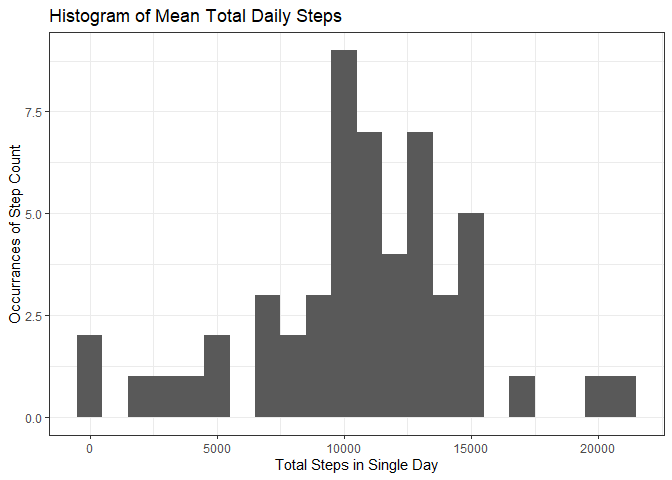
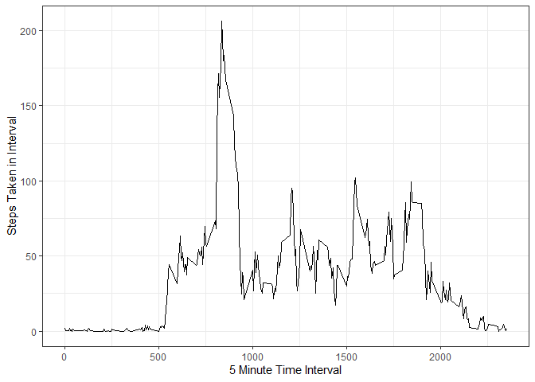
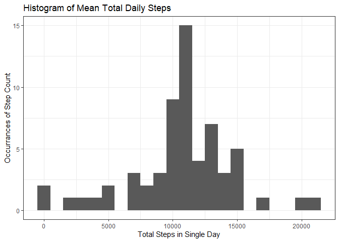
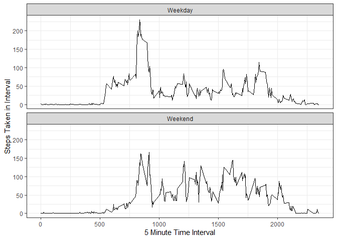

```r
knitr::opts_chunk$set(echo = TRUE)

library(ggplot2)
library(lubridate)
```

```
## 
## Attaching package: 'lubridate'
```

```
## The following objects are masked from 'package:base':
## 
##     date, intersect, setdiff, union
```

## Loading and preprocessing the data

```r
activity <- read.csv("activity.csv")
activity$day <- weekdays(as.Date(activity$date))
```

## What is mean total number of steps taken per day?

```r
aggActivityByDate <- aggregate(steps ~ date, activity, sum, na.rm = TRUE)

ggplot(aggActivityByDate, aes(x = steps, fill = steps)) +
    geom_histogram(binwidth = 1000) + 
    labs(title = "Histogram of Mean Total Daily Steps", x = "Total Steps in Single Day", y = "Occurrances of Step Count") +
    theme_bw()
```

<!-- -->

```r
cat("Mean steps: ", mean(aggActivityByDate$steps), "\n")
```

```
## Mean steps:  10766.19
```

```r
cat("Median steps: ", median(aggActivityByDate$steps), "\n")
```

```
## Median steps:  10765
```

## What is the average daily activity pattern?

```r
aggActivityByInterval <- aggregate(steps ~ interval, activity, mean, na.rm = TRUE)

ggplot(data = aggActivityByInterval, aes(x = interval, y = steps)) +
    geom_line() +
    labs(x = "5 Minute Time Interval", y = "Steps Taken in Interval") + 
    theme_bw()
```

<!-- -->

```r
cat("The five minute interval at: ", aggActivityByInterval$interval[which.max(aggActivityByInterval$steps)], " had the greatest number of steps on average across all days.\n")
```

```
## The five minute interval at:  835  had the greatest number of steps on average across all days.
```


## Imputing missing values

```r
summary(activity)
```

```
##      steps                date          interval          day           
##  Min.   :  0.00   2012-10-01:  288   Min.   :   0.0   Length:17568      
##  1st Qu.:  0.00   2012-10-02:  288   1st Qu.: 588.8   Class :character  
##  Median :  0.00   2012-10-03:  288   Median :1177.5   Mode  :character  
##  Mean   : 37.38   2012-10-04:  288   Mean   :1177.5                     
##  3rd Qu.: 12.00   2012-10-05:  288   3rd Qu.:1766.2                     
##  Max.   :806.00   2012-10-06:  288   Max.   :2355.0                     
##  NA's   :2304     (Other)   :15840
```

```r
sum(!complete.cases(activity))
```

```
## [1] 2304
```

```r
cat("Total number of missing values is ", sum(!complete.cases(activity)), ". With missing values only appearing in the steps column per the summary above.\n")
```

```
## Total number of missing values is  2304 . With missing values only appearing in the steps column per the summary above.
```

```r
completeActivity <- activity
for(x in 1:nrow(completeActivity)){
    if(is.na(completeActivity$steps[x])) {
        storeInterval <- completeActivity$interval[x]
        completeActivity$steps[x] <- aggActivityByInterval$steps[which(aggActivityByInterval$interval == storeInterval)]
    }
}
```


```r
completeAggActivityByDate <- aggregate(steps ~ date, completeActivity, sum, na.rm = TRUE)

ggplot(completeAggActivityByDate, aes(x = steps, fill = steps)) +
    geom_histogram(binwidth = 1000) + 
    labs(title = "Histogram of Mean Total Daily Steps", x = "Total Steps in Single Day", y = "Occurrances of Step Count") +
    theme_bw()
```

<!-- -->

```r
cat("Mean steps: ", mean(completeAggActivityByDate$steps), "\n")
```

```
## Mean steps:  10766.19
```

```r
cat("Median steps: ", median(completeAggActivityByDate$steps), "\n")
```

```
## Median steps:  10766.19
```
These values differ very slightly from our mean and median prior to imputation.
The impact of this imputation was an increase in the occurrance of the step median in our bar graph and in the bars nearest the median because our imputation was based around this value. This is also why our Mean and Median are now equal, due to the method in which we chose to imputate being using the median of each interval.

## Are there differences in activity patterns between weekdays and weekends?

```r
for(x in 1:nrow(activity)){
    if(completeActivity$day[x] %in% c("Saturday", "Sunday")){
        completeActivity$weekday[x] <- "Weekend"
    } else {
        completeActivity$weekday[x] <- "Weekday"
    }
}
```

```r
completeActivity$weekday <- as.factor(completeActivity$weekday)

weekendData <- subset(completeActivity, weekday == "Weekend")
weekendAggCompleteByInterval <- aggregate(steps ~ interval, weekendData, mean, na.rm = TRUE)
if(ncol(weekendAggCompleteByInterval) == 2) {
    weekendAggCompleteByInterval <- cbind(weekendAggCompleteByInterval, "Weekend")
}
names(weekendAggCompleteByInterval)[3] <- "DayType"

weekdayData <- subset(completeActivity, weekday == "Weekday")
weekdayAggCompleteByInterval <- aggregate(steps ~ interval, weekdayData, mean, na.rm = TRUE)
if(ncol(weekdayAggCompleteByInterval) == 2){
weekdayAggCompleteByInterval <- cbind(weekdayAggCompleteByInterval, "Weekday")
}
names(weekdayAggCompleteByInterval)[3] <- "DayType"

intervalAggData <- rbind(weekdayAggCompleteByInterval, weekendAggCompleteByInterval)

ggplot(data = intervalAggData, aes(x = interval, y = steps)) +
    geom_line() +
    facet_wrap(~ DayType, nrow = 2, ncol = 1) +
    labs( x = "5 Minute Time Interval", y = "Steps Taken in Interval") + 
    theme_bw()
```

<!-- -->


Weekdays have the greatest peak in steps during specific intervals. But, the overall average shown in the graph for steps over the course of the average weekend day is higher across a large number of time intervals. It is likely that if we looked deeper into the set, we would be able to confirm people are more consistent with their steps on weekends than weekdays.


